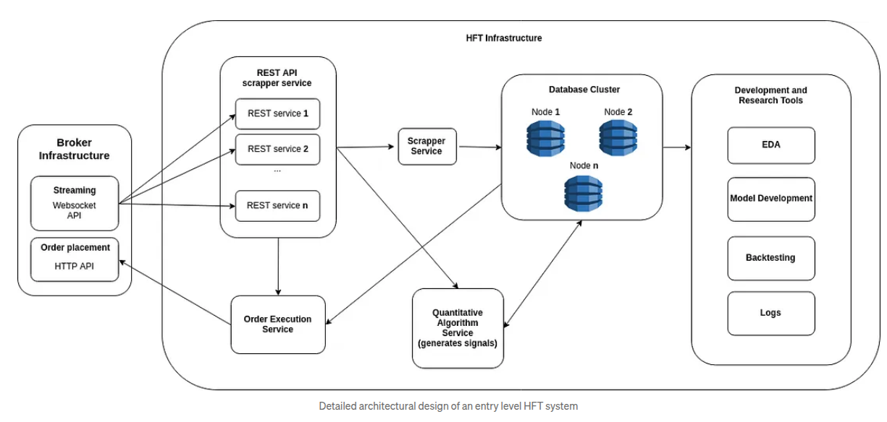
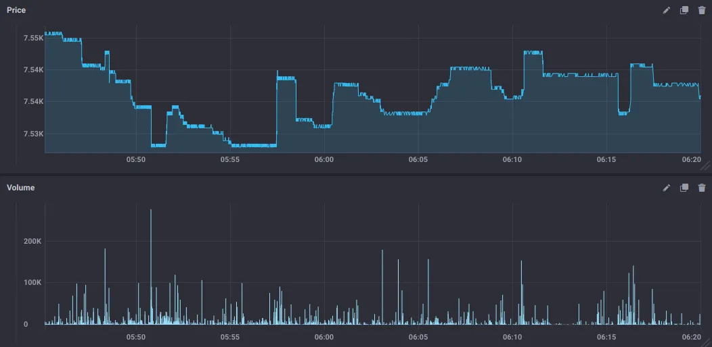
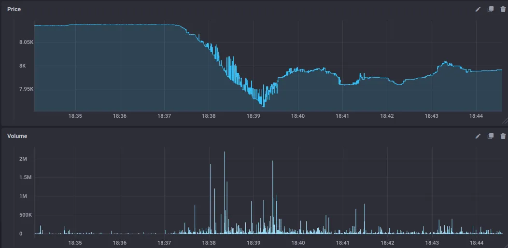

# energy-rest-api
## run
`pip install -r requrements.txt`

Initial part of the whole power-trading-system
## over of microservice like archtiecture
<figure style="display: flex; gap: 20px; align-items: center; justify-content: center; margin: 0 auto;">
  
</figure>

## architecutral decisions: 
- multi-component system -> fault tolerance and scalable (e.g. system outage of third-party-data/service providers [DOS attacks])
- handle broker outages: 
<figure style="display: flex; gap: 20px; align-items: center; justify-content: center; margin: 0 auto;">
  
</figure>
<figure style="display: flex; gap: 20px; align-items: center; justify-content: center; margin: 0 auto;">
  
</figure>

### database
- high density time series db
- potentially compensate a dozen data insertions hourly 
- immutable (unveränderlich) -> necessery for integrity
- distributed -> required to run in an distributed environment

### scrapper 
- inserts newly streamed data to the database

### quant models
- seek for alpha 

### order execution
- picks up signales from the Quant Model interacts with market
- strategy needs slippage (price is worde than expected due to market volumina) requirements for illequide markets (not enough volume in the markets)
- microsystem: optimize limit orders on the capacity/liquidity of markets (savings due to execution of limit orders in order with less fees than market oders [instant execution])
### quant analysis
- models (tools and algorithms) based on the systems provided data
- integrate boundary conditions: messure and predict not full access to the market
- logging: use logging of exceptional events, to integrate in the quant models

## architectural details
https://medium.com/data-science/assembling-an-entry-level-high-frequency-trading-hft-system-e7538545b2a9